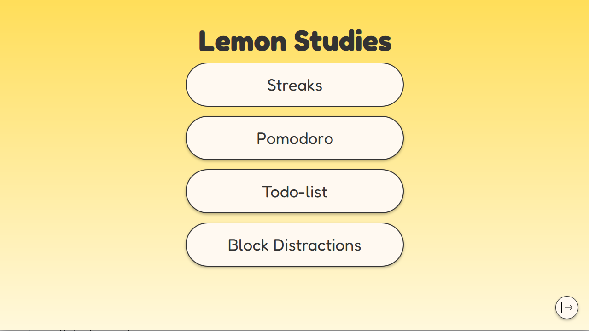
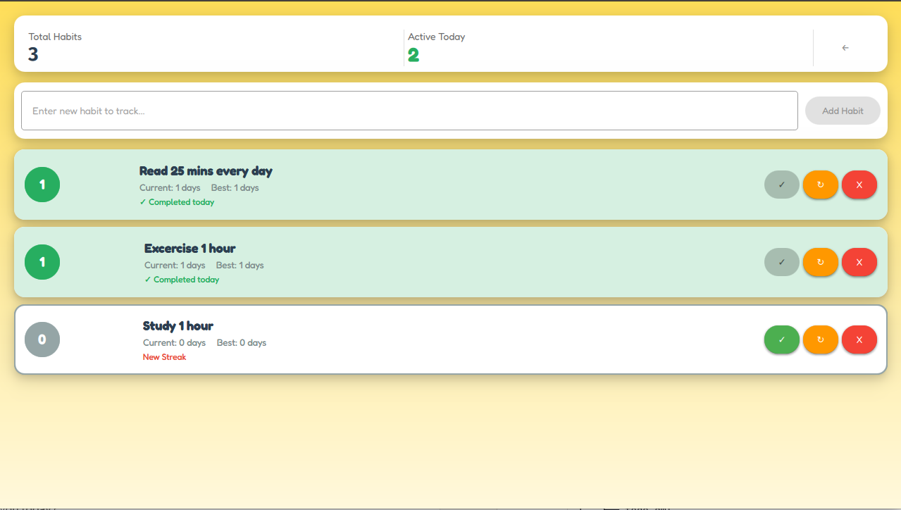
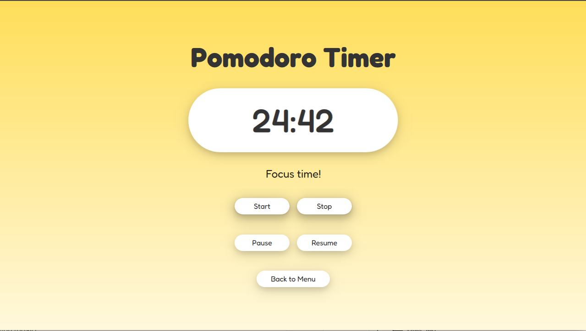
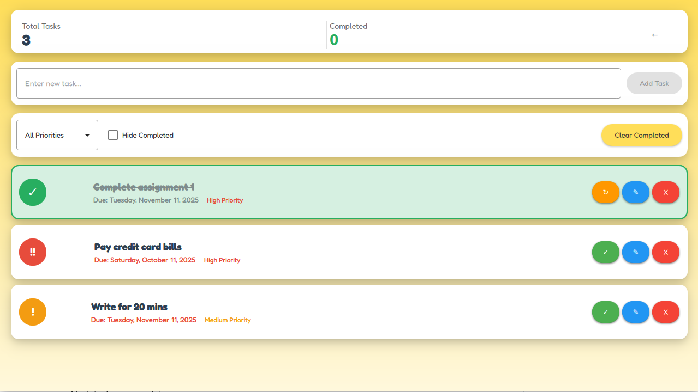

# 🍋 Lemon Studys

A modern, feature-rich study tracking application built with Qt/QML and C++, featuring a distinctive lemon-yellow aesthetic and Material Design principles.


## Screenshots


*Main menu showing all available features*


*Daily habit streak tracking with visual indicators*


*Pomodoro timer in action*


*Task list with priority indicators and deadlines*

## Overview

Lemon Studys is a productivity application designed to help students and professionals manage their study sessions, track habits, and organize tasks. The application combines modern UI/UX principles with a cohesive visual identity, demonstrating full-stack development capabilities in desktop application development.

## Features


### 🔥 Streak Tracking
- Daily habit monitoring
- Visual streak indicators


### 🍅 Pomodoro Timer
- Focus session tracking
- Audio notifications for session transitions

### ✅ Task Management
- Add and organize tasks with descriptions
- Assign deadlines to track time-sensitive tasks
- Mark tasks as complete


## Project Structure

```
lemonStudys/
├── qml/
│   ├── MainMenu.qml
│   ├── WelcomeScreen.qml
│   ├── PomodoroView.qml
│   ├── streaks.qml
│   └── todo.qml
├── assets/
│   ├── sounds/
│   ├── fonts/
│   └── images/
├── src/
│   └── [C++ backend files]
├── CMakeLists.txt
└── README.md
```

## Installation

### Prerequisites
- Qt 6.8.1 or higher (installed via Qt installer)
- CMake 3.16 or higher
- C++17 compatible compiler

### Building from Source

1. Clone the repository:
```bash
git clone https://github.com/rxa14/MyStudyTrackingApp.git
cd MyStudyTrackingApp
```

2. Create build directory:
```bash
mkdir build && cd build
```

3. Configure with CMake:
```bash
cmake ..
```

4. Build the project:
```bash
cmake --build .
```

5. Run the application:
```bash
./applemonStudys
```


*Lemon Studys - Making productivity a little more refreshing 🍋*
